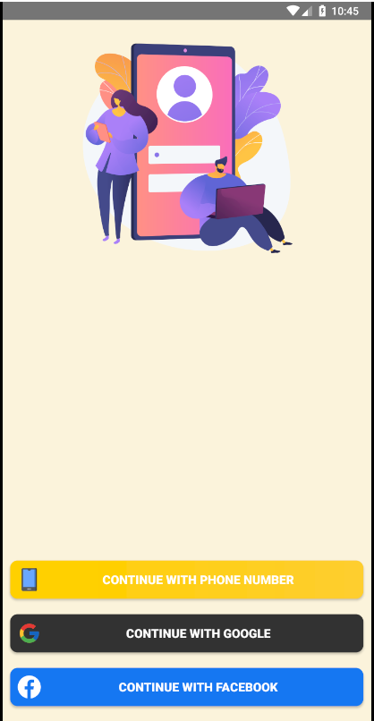
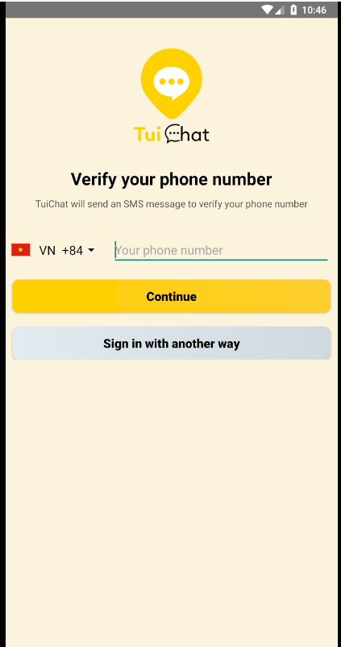
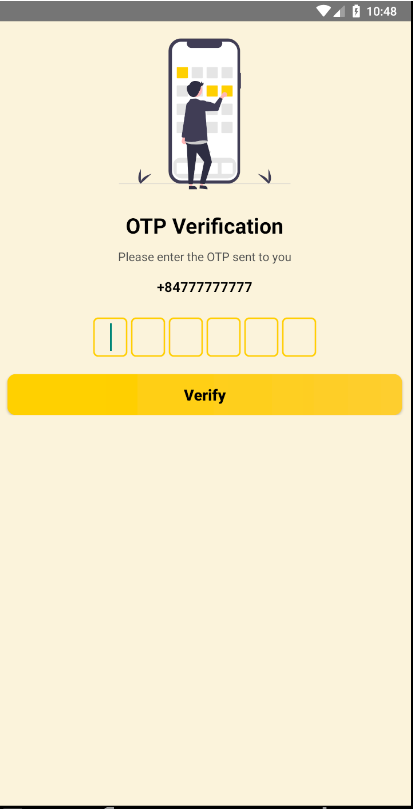
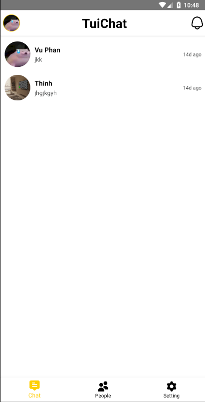
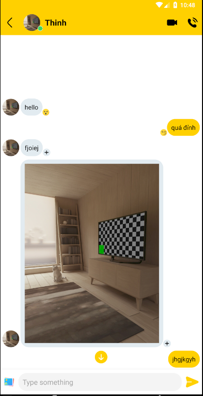
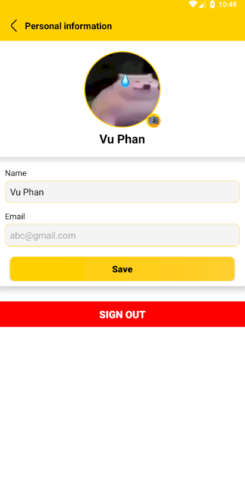
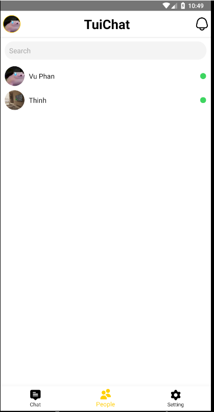
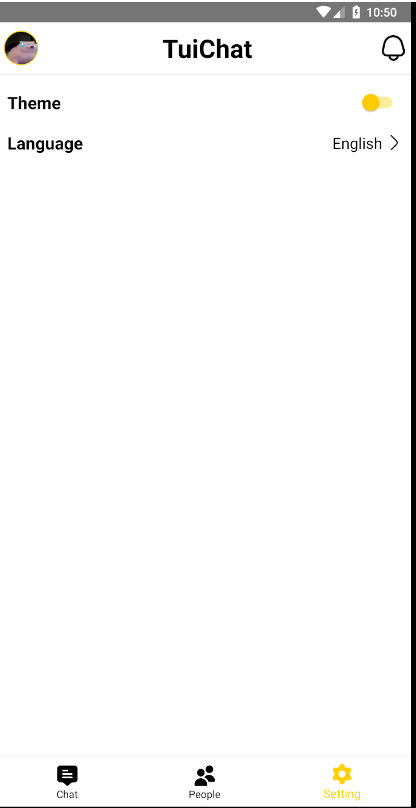
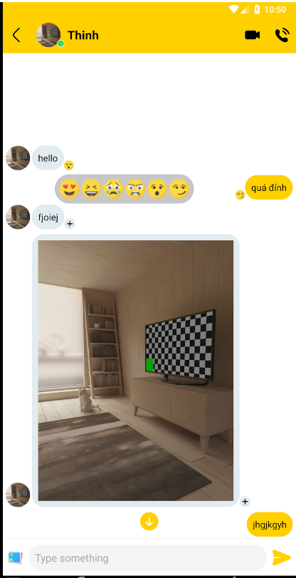
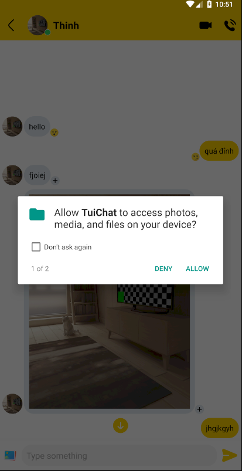

# WeChat

- [WeChat](#wechat)
  - [Install Project](#install-project)
  - [Environment](#environment)
  - [Account Test](#account-test)
  - [Screen](#screen)
    - [```Man hinh login```](#man-hinh-login)
    - [```Man hinh Dang Nhap otp```](#man-hinh-dang-nhap-otp)
    - [```Man hinh Dang Nhap bang otp dien thoai```](#man-hinh-dang-nhap-bang-otp-dien-thoai)
    - [```Man hinh Home```](#man-hinh-home)
    - [```Man hinh Mot so chuc nang khi nhan tin```](#man-hinh-mot-so-chuc-nang-khi-nhan-tin)
    - [```Man hinh Sua thong tin ca nhan```](#man-hinh-sua-thong-tin-ca-nhan)
    - [```Man hinh Them Ban Be```](#man-hinh-them-ban-be)
    - [```Man hinh Cai Dat```](#man-hinh-cai-dat)
    - [```Man hinh Giao dien nhan tin```](#man-hinh-giao-dien-nhan-tin)
    - [```Man hinh Nhan Tin kem hinh anh```](#man-hinh-nhan-tin-kem-hinh-anh)

>## Create chat app with Android-Java + Firebase
>## Nhom 11 

## Install Project
``` gh repo clone phancaovu/we-chat-uit ```

## Environment 
    ### Java 1.8 hoac 11

## Account Test 
    sdt: 777777777 otp: 7777777
## Screen
### ```Man hinh login```



### ```Man hinh Dang Nhap otp```


### ```Man hinh Dang Nhap bang otp dien thoai```


### ```Man hinh Home```


### ```Man hinh Mot so chuc nang khi nhan tin```


### ```Man hinh Sua thong tin ca nhan```


### ```Man hinh Them Ban Be```


### ```Man hinh Cai Dat```


### ```Man hinh Giao dien nhan tin```


### ```Man hinh Nhan Tin kem hinh anh```



